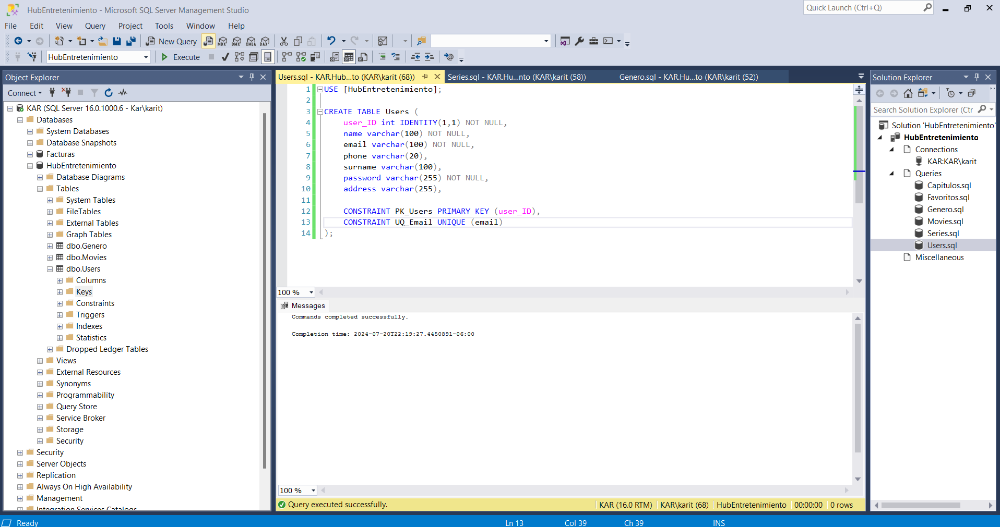

# HubEntretenimiendo

### Sprint 4 
## KARLA ITZEL JIMENEZ MOLINA

### 1. Resumen del proyecto 
Este proyecto es un hub de entretenimiento en el cual se muestran peliculas y series a las cuales el usuario las puede agregar a favoritos si lo desea.

### 2. Requerimientos tecnicos -
Conocimientos SQL  
Conocimiento de servidores

### 3. ¿Como instalar?
1. Clone the repository:

git clone https://github.com/Karit08/Back-end-HubEntretenimiento.git

2. Change to the project directory:

cd youRepository/Back-end-HubEntretenimiento

3. Install the dependencies:

npm install

4. Create a .env file in the root of the project and add your environment variables following the .env.template

DB_User="User to database"  
DB_Password="Password to database"  
DB_Server="Server name"  
DB_Database="Server name"  
DB_Port="Server port"  
Port="Port number"

### 4. Capturas de pantalla 

Diagrama de entidad-relacion de Base de Datos.

SQL Server.

#### 4.1 Routes
************************************************
- Users Routes

    POST /users

Description: Create a new user.
Request: JSON body with user details.
Response: JSON message indicating success or failure.
    
    GET /users

Description: Get a all users.
Request: None.
Response: User data.

    GET /users/:id

Description: Get a user by ID.
Request: None.
Response: User data.

    PUT /users/:id

Description: Update a user by ID.
Request: JSON body with user details.
Response: JSON message indicating success or failure.
    
    DELETE /users/:id

Description: Delete a user by ID.
Request: None.
Response: JSON message indicating success or failure.

*********************************************************
- Movies Routes

    POST /movies

Description: Create a new movies.
Request: JSON body with movies details.
Response: JSON message indicating success or failure.

    GET /movies

Description: Get all movies.
Request: None.
Response: Array of movies.

    GET /movies/:id

Description: Get a movies by ID.
Request: None.
Response: Series data.
    
    PUT /movies/:id

Description: Update a movies by ID.
Request: JSON body with movies details.
Response: JSON message indicating success or failure.

    DELETE /movies/:id

Description: Delete a series by ID.
Request: None.
Response: JSON message indicating success or failure.
    

*******************************************************
- Series Routes

    POST /series

Description: Create a new series.
Request: JSON body with series details.
Response: JSON message indicating success or failure.

    GET /series

Description: Get all series.
Request: None.
Response: Array of Series.

    GET /series/:id

Description: Get a series by ID.
Request: None.
Response: Series data.
    
    PUT /series/:id

Description: Update a series by ID.
Request: JSON body with series details.
Response: JSON message indicating success or failure.

    DELETE /series/:id

Description: Delete a series by ID.
Request: None.
Response: JSON message indicating success or failure.
    

*******************************************************
- Capitulos Routes

    POST /capitulos

Description: Create a new capitulos.
Request: JSON body with capitulos details.
Response: JSON message indicating success or failure.

    GET /capitulos

Description: Get all capitulos.
Request: None.
Response: Array of capitulos.

    GET /capitulos/:id

Description: Get a capitulos by ID.
Request: None.
Response: Capitulos data.
    
    PUT /capitulos/:id

Description: Update a capitulos by ID.
Request: JSON body with capitulos details.
Response: JSON message indicating success or failure.

    DELETE /capitulos/:id

Description: Delete a capitulos by ID.
Request: None.
Response: JSON message indicating success or failure.

*******************************************************
- Favoritos Routes

    POST /favoritos

Description: Create a new favoritos.
Request: JSON body with favoritos details.
Response: JSON message indicating success or failure.

    GET /favoritos

Description: Get all favoritos.
Request: None.
Response: Array of favoritos.
    
    GET /favoritos/user/:user_ID

Description: GET an favoritos by user's ID .
Request: None.
Response: JSON message indicating success or failure.

    GET /favoritos/:id

Description: Get a favoritos by ID.
Request: None.
Response: Favoritos data.
    
    PUT /favoritos/:id

Description: Update a favoritos by ID.
Request: JSON body with favoritos details.
Response: JSON message indicating success or failure.

    DELETE /favoritos/:id

Description: Delete a favoritos by ID.
Request: None.
Response: JSON message indicating success or failure.

### 5. Proceso que seguí para realizar el proyecto
Me guie con el curso Bases de datos empresariales con el gestor Microsoft SQL Server 2019, el lenguaje T-SQL y Management Studio

### 6. Tabla con Sprint Review 

| Que salio bien? | Que puedo hacer diferente? | Que no salio bien ? |
------------------|----------------------------|-----------------------
| Realizar tablas en SQL | La forma de organizarme  | Entender como conectar T-SQL a mi proyecto |
